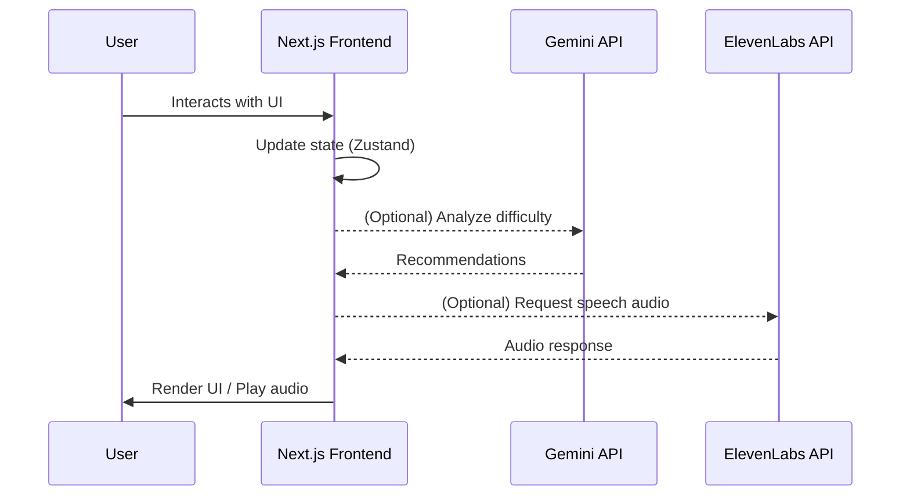
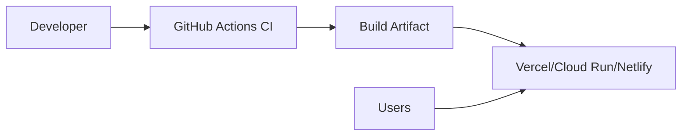

# Architecture Overview

This document describes the high-level architecture of the application.

## System Context

```mermaid
flowchart LR
  user[End User (Learner/Parent)] -->|browser| app[Next.js Frontend]
  parent[Parent/Admin] --> app
  subgraph Optional Integrations
    ai[Google Gemini AI]
    tts[ElevenLabs TTS]
  end
  app -->|HTTPS| ai
  app -->|HTTPS| tts
```

## App Modules

```mermaid
flowchart TB
  A[App Router (app/)] --> B[UI Components (components/)]
  A --> C[Features (features/parent-dashboard)]
  A --> D[Hooks (hooks/)]
  A --> E[State (store/)]
  A --> F[Lib (lib/geminiAI, lib/elevenLabsVoice)]
```

## Data Flow



## Deployment



## Security Considerations
- No secrets in client bundles; use only `NEXT_PUBLIC_*` for public config
- Enforce HTTPS and CSP where deployed
- Handle errors via error boundaries and safe messages
- See `SECURITY.md` and `docs/threat-model.md` for details
