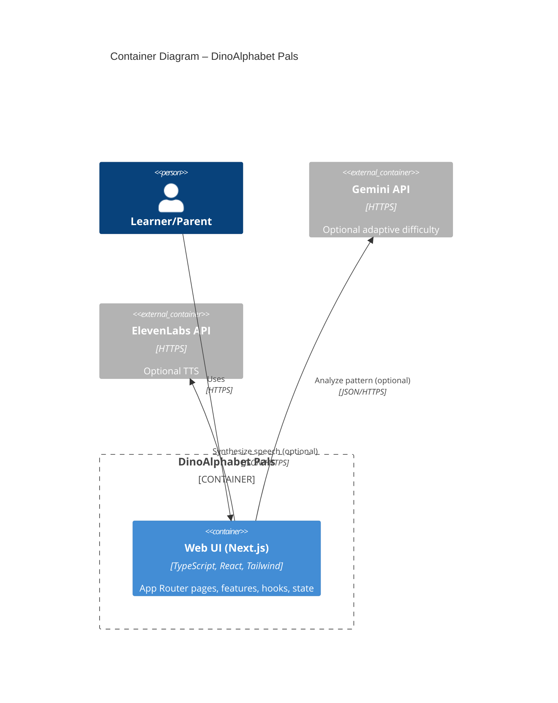

Implementation locations:
- UI: `app/`, `components/`, `features/`
- State: `store/`
- AI: `lib/geminiAI.ts`, hooks in `hooks/useAdaptiveDifficulty.ts`
- Voice: `lib/elevenLabsVoice.ts`, hooks in `hooks/useEnhancedVoice.ts`