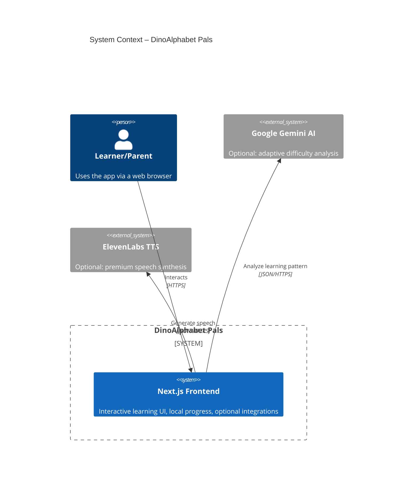

```mermaid
C4Context
title System Context – DinoAlphabet Pals

Person(user, "Learner/Parent", "Uses the app via a web browser")

System_Boundary(app, "DinoAlphabet Pals") {
  System(frontend, "Next.js Frontend", "Interactive learning UI, local progress, optional integrations")
}

System_Ext(gemini, "Google Gemini AI", "Optional: adaptive difficulty analysis")
System_Ext(eleven, "ElevenLabs TTS", "Optional: premium speech synthesis")

Rel(user, frontend, "Interacts", "HTTPS")
Rel(frontend, gemini, "Analyze learning pattern", "JSON/HTTPS")
Rel(frontend, eleven, "Generate speech", "JSON/HTTPS")

UpdateLayoutConfig($c4ShapeInRow="3", $c4BoundaryInRow="1")
```

Notes:
- External services are optional and disabled by default.
- Without keys, the app uses local rule-based difficulty and browser TTS.