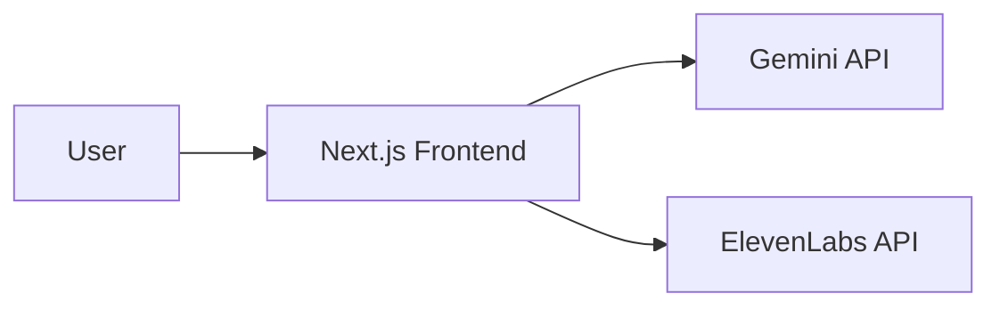

# Threat Model (STRIDE)

## Scope
Client-side Next.js app with optional AI (Gemini) and TTS (ElevenLabs) integrations.

## Diagram

## STRIDE Summary
- Spoofing: Use HTTPS endpoints; do not trust client identity for sensitive actions.
- Tampering: Integrity via locked dependencies and CI builds; avoid storing secrets in client.
- Repudiation: Basic client logs only; consider server-side logging if a backend is added.
- Information Disclosure: No PII collected; ensure no secrets in client env; mask error details.
- Denial of Service: Rate-limit login routes at reverse proxy; debounced API calls.
- Elevation of Privilege: Parent dashboard uses simple client gate; for production use server auth.

## Mitigations
- Content Security Policy and HTTPS when deploying
- Error boundaries with safe messages
- Dependency scanning (audit) and CodeQL in CI
- SBOM generation to track supply chain risk
- Security reporting policy in `SECURITY.md`

## Residual Risks
- Client-only auth is not strong; avoid for sensitive data
- Third-party API availability impacts features
